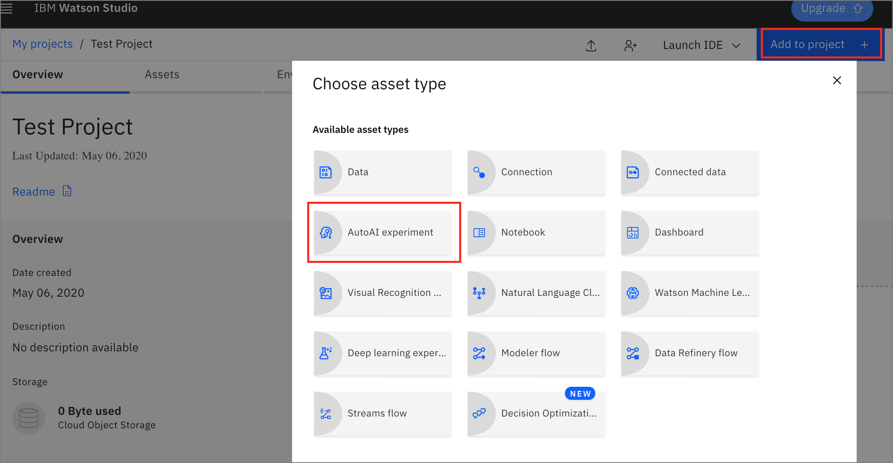
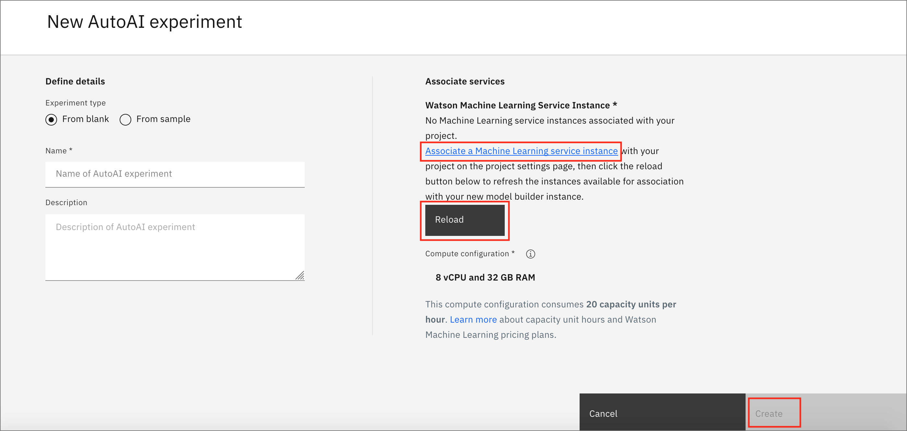
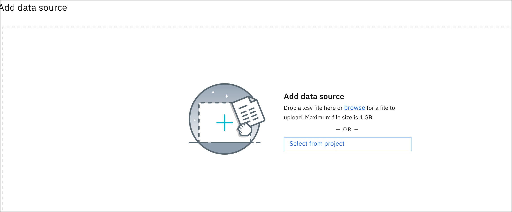
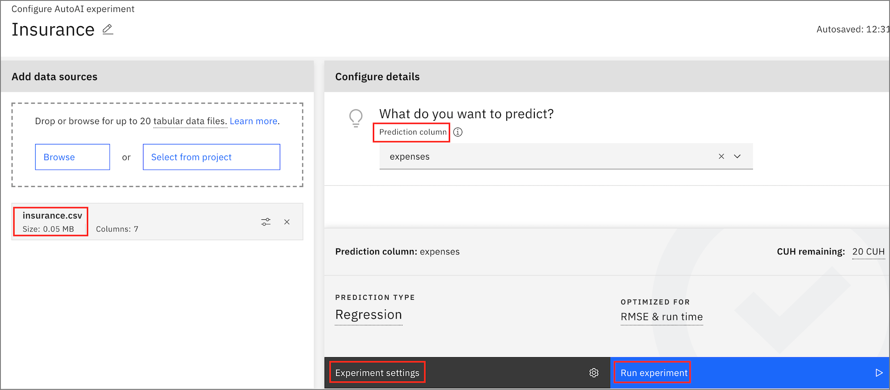
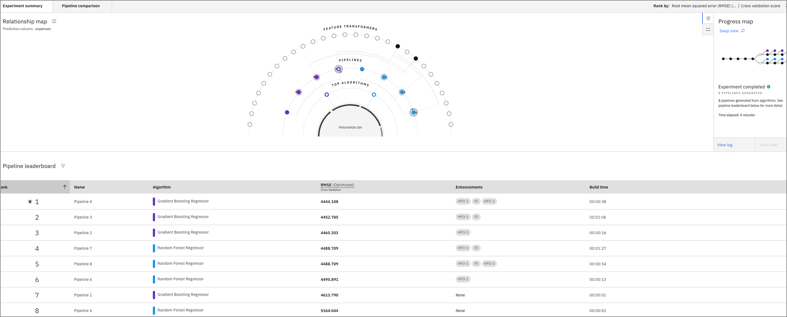

# Machine Learning Models with Auto AI 

In this workshop you will learn how to build and deploy your own AI Models.

For the workshop we will be using AutoAI, a graphical tool that analyses your dataset and discovers data transformations, algorithms, and parameter settings that work best for your problem setting.

Using AutoAI, you can build and deploy a machine learning model with sophisticated training features and no coding.

We will a public dataset to build and deploy model pipelines, and analyse the outcome.

## Set up

Make sure that you have followed the steps in the [project setup](../project-setup/README.md) to create a project and set up your IBM Cloud account and Cloud Pak for Data as a Service.

### Once you are in the Project Dashboard, click on "Add to Project" on the top right and select AutoAI Experiment 

### Associate a Machine Learning service 

- Give your Auto AI experiment a unique name 
- Associate a Watson Machine Learning service, if you have already created one this will apear in the dropdown or you can create a new one. 
- Once this is done, click the "Reload" button for your Machine Learning service to appear 

- Your machine learning service will appear under "Associated services"
- Click Create 

### Upload your Data Sets

- Browse and add your Data source. You will have already added *insurance.csv* to your project assets in the [project setup](../project-setup/README.md) steps. Click `Select from project` and choose the *insurance.csv* file.

- Once your dataset is successfully uploaded, you will see an option to choose your **prediction column**. Optionally, you can also refer to the experiment settings to make changes to the AutoAI Experiment. Once done, click on Run Experiment. 

### Completed AutoAI experiment 

- The experiment will take approximagely 20 minutes to run. You can check on the progress during that time. When completed, it will show the results of the exeriment.

### In the next module, we will work through the different aspects of configuring our AutoAI experiment and discuss the outcome of the experiment.
 

## [Deploying the model](../autoai-deploy/README.md)
