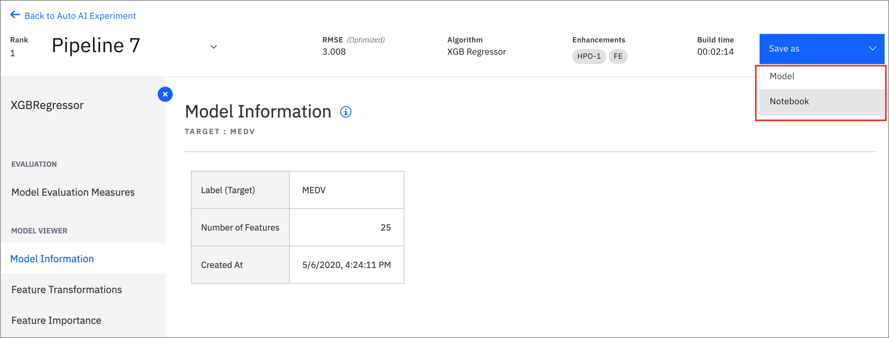
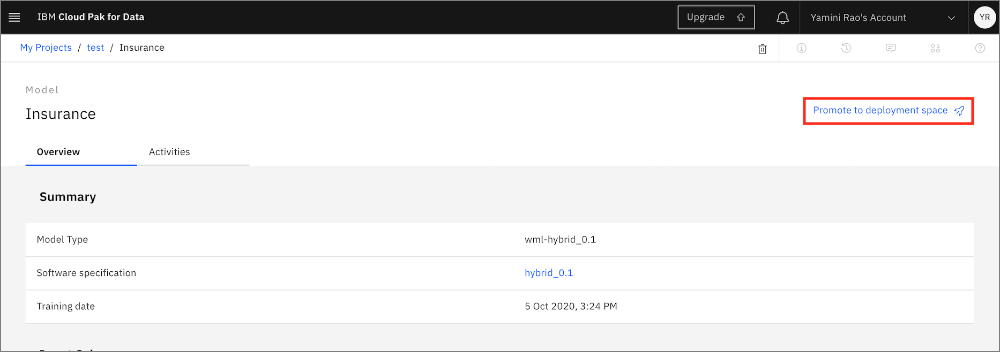
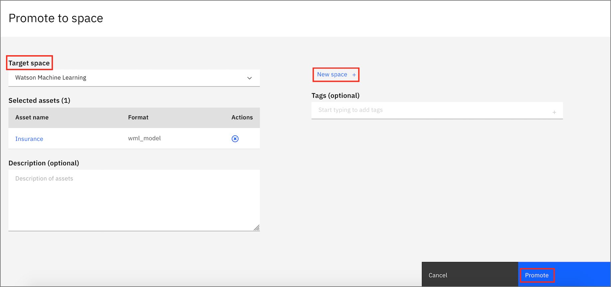
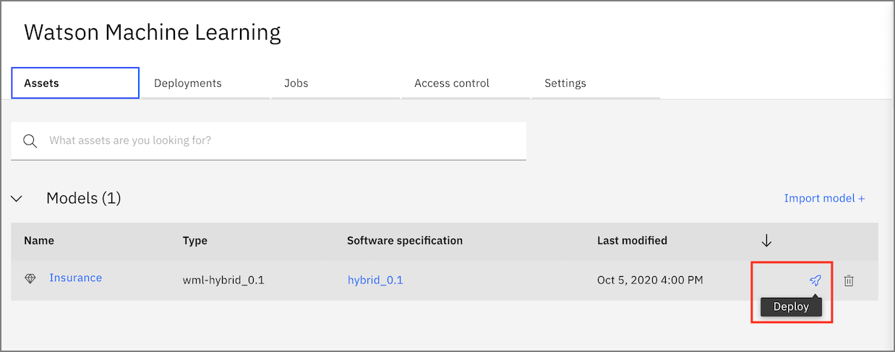
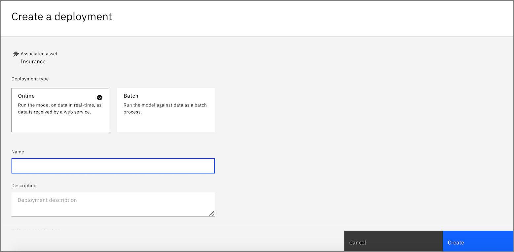
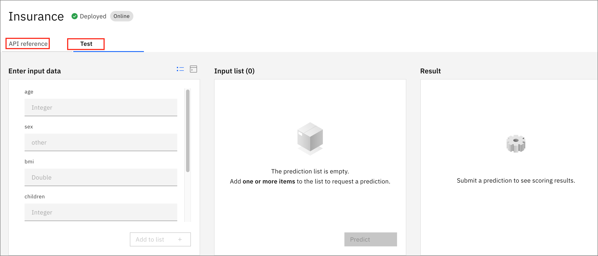

# Deploying your Model 

This is the second AutoAI module, and assumes that you have already [created and ran the AutoAI experiment](../autoai-build/README.md).

- Once you select your final model pipeline. You can choose to Save it as a notebook or an ML model. 

- Choose **model** and click save  

- Once your model is saved you will see a popup to <b> View in Project </b> or you can access the saved model from the <b> Assets </b> tab. 

- Click on the saved model and <b> Promote to a deployment space </b>

- Select the target deployment space you want to use for this deployment. If you do not have one yet, you can create a <b> new space. </b> 

- Access the deployment space from the left navigation pane. 

- In your Deployment Space, Choose the model you want to deploy from the <b> Assets </b> tab and click the <b> deploy </b> icon as shown

- Choose your Deployment type and create your Deployment. 

<b> Once your model is successuly deployed, you can access the API reference to make API calls or Test your model by providing input using a form or in a JSON format </b>

##  Save the model as a Jupyter notebook

Next we will [Save your pipeline as a notebook](../autoai-notebook/notebook.md) 
