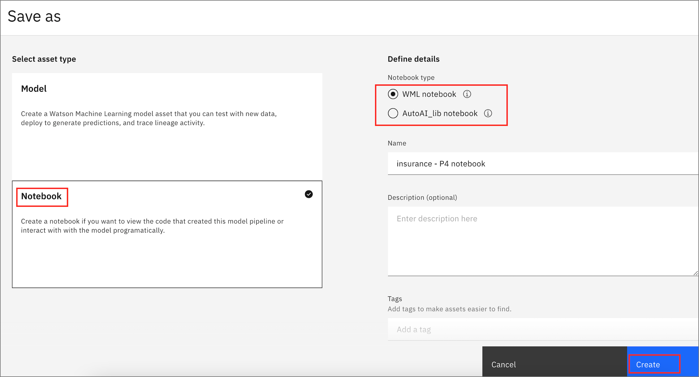

### Saving your pipeline as a notebook 

- You can create a notebook if you want to view the code that created the model pipeline or interact with the model programatically.

- Select the pipeline of your choice and click **save as** and choose the notebook option.

- You can choose the **notebook type** as a WML notebook to work with a trained model in a notebook, review and update the code, view visualisations and also deploy the model with Watson Machine Learning. 

- OR you can choose to save it as a AutoAI_lib notebook where you can view the sci-kit learn source code for the trainel model in the notebook. 

#### - Once you click create the notebook will be created for you to access within the project.

