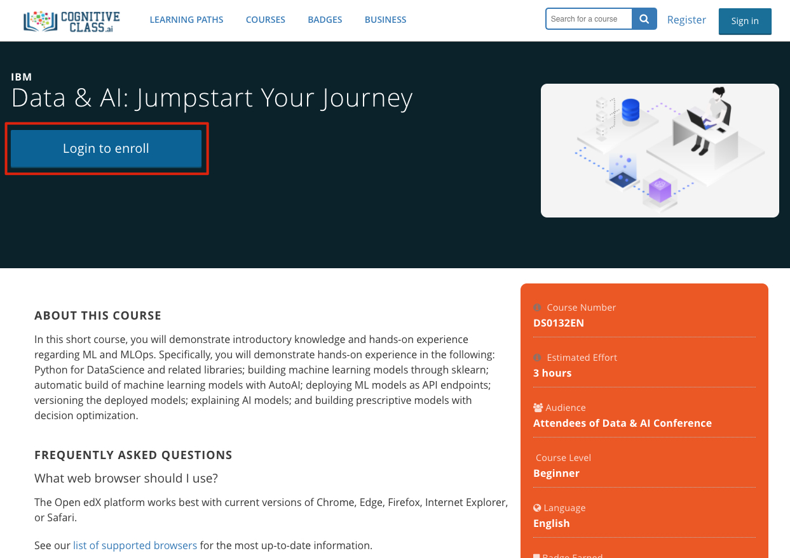
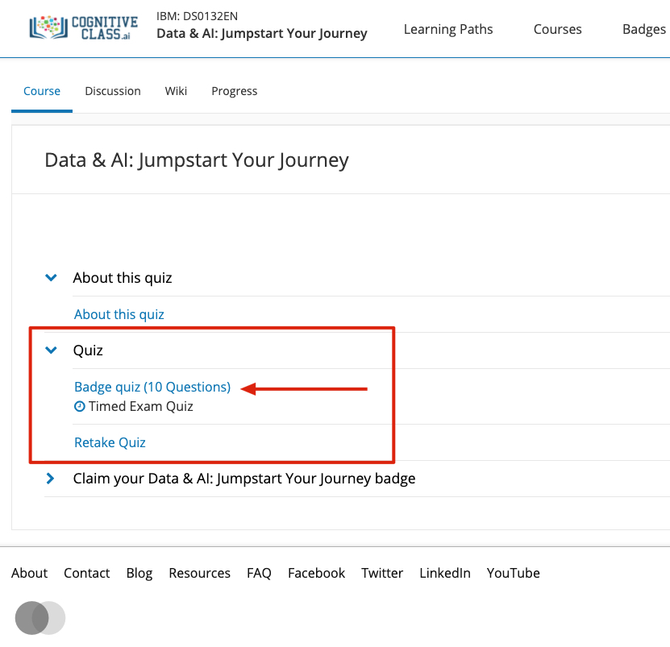
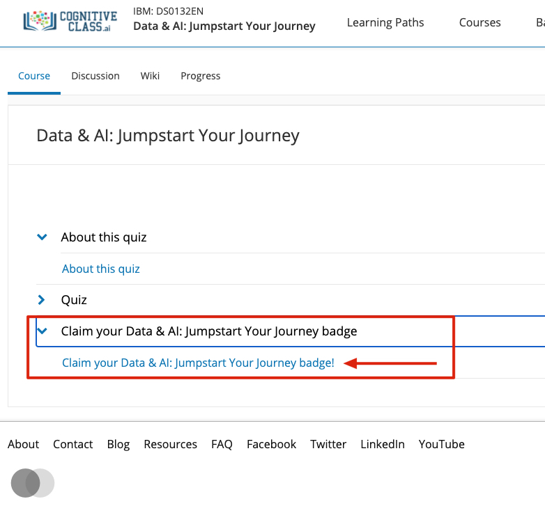
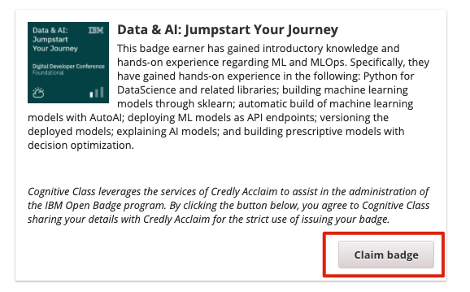

# Claiming your badge

## How to claim your badge

Congratulations on completing this course, the last step to getting you badge is to complete a short quiz and claim your badge. Here are the step to claiming your badge.

* Go to the following Cognitive Class course: [Data & AI: Jumpstart Your Journey](https://cognitiveclass.ai/courses/data-and-ai-jumpstart-your-journey)
* Click "Login to Enroll"

* If you are a first time user, click "Create an Account". Otherwise, login with your credentials.

* Once signed in, expand the Quiz section in the middle of the page and click on the "badge quiz"

* Once you complete the quiz and pass, navigate back the the course page and select the "Claim Data & AI: Jumpstart Your Journey badge" section. 

* If you have successfully passed the quiz you will see a "Claim Badge" at the bottom of the page. Click the button to claim you badge.

That's it! Congratulation on your badge and great job on completing the course! For more learning opportunities, you can take a look at Track 7 of the conference, or other learning content on https://developer.ibm.com

