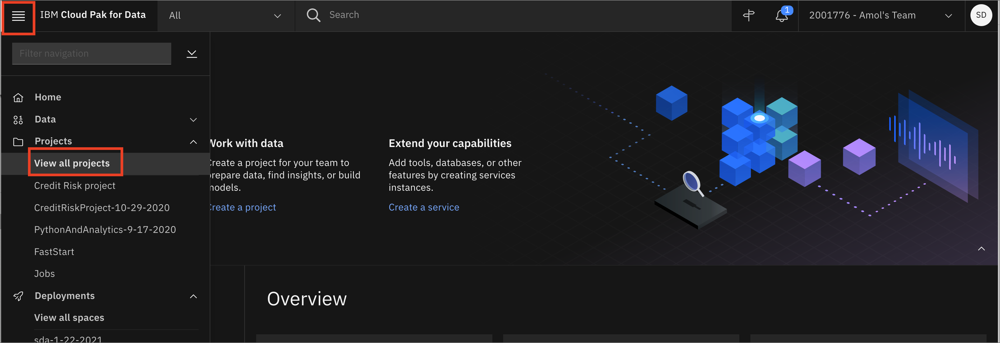
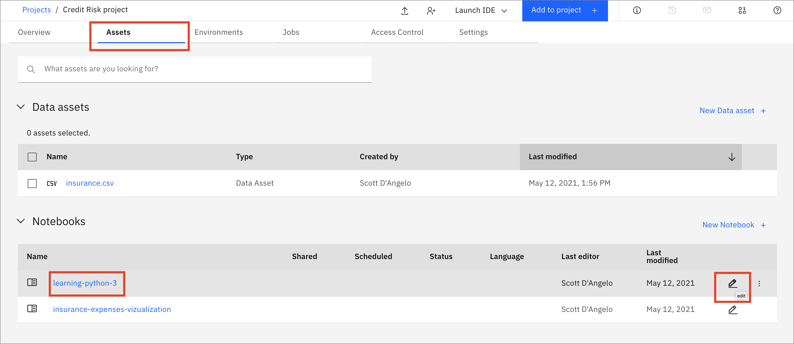

# Learning Python3

## What is Python?

From the [Python.org documentation](https://www.python.org/doc/essays/blurb/):

```
Python is an interpreted, object-oriented, high-level programming language with dynamic semantics. Its high-level built in data structures, combined with dynamic typing and dynamic binding, make it very attractive for Rapid Application Development, as well as for use as a scripting or glue language to connect existing components together. Python's simple, easy to learn syntax emphasizes readability and therefore reduces the cost of program maintenance. Python supports modules and packages, which encourages program modularity and code reuse. The Python interpreter and the extensive standard library are available in source or binary form without charge for all major platforms, and can be freely distributed.

Often, programmers fall in love with Python because of the increased productivity it provides. Since there is no compilation step, the edit-test-debug cycle is incredibly fast. Debugging Python programs is easy: a bug or bad input will never cause a segmentation fault. Instead, when the interpreter discovers an error, it raises an exception. When the program doesn't catch the exception, the interpreter prints a stack trace. A source level debugger allows inspection of local and global variables, evaluation of arbitrary expressions, setting breakpoints, stepping through the code a line at a time, and so on. The debugger is written in Python itself, testifying to Python's introspective power. On the other hand, often the quickest way to debug a program is to add a few print statements to the source: the fast edit-test-debug cycle makes this simple approach very effective. 
```

You might think that **Python** is only for developers and people with computer science degrees. However, Python is great for beginners, even those with little coding experience because it’s free, open source, and runs on any platform. The Python packages documentation is great, and after an [introductory course](https://cognitiveclass.ai/learn/data-science-with-python), you have a good foundation to build on.

For Data Scientists, Python has become an invaluable tool. This notebook will help you get started or review the basics of Python.

## Getting Started with Jupyter Notebooks

Instead of writing code in a text file and then running the code with a Python command in the terminal, you can do all of your data analysis in one place. Code, output, tables, and charts can all be edited and viewed in one window in any web browser with [Jupyter Notebooks](https://jupyter.org/). As the name suggests, this is a notebook to keep all of your ideas and data explorations in one place. In this tutorial, you use [IBM Watson Studio](https://dataplatform.cloud.ibm.com/docs/content/wsj/getting-started/overview-ws.html) to run a notebook. For this, you need a free IBM Cloud account. The following steps show you how sign up and get started. When you have the notebook up and running, you can go through the notebook.

Jupyter notebooks are an open-source web application that allows you to create and share documents that contain live code, equations, visualizations and explanatory text.

In this workshop we will use IBM Watson Studio to run a notebook. For this you will need an IBM Cloud account. The following steps will show you how sign up and get started. When you have the notebook up and running we will go through the notebook.

If you have not already done so, make sure that you do the work for your [project setup](../project-setup/README.md)

## Load and Run a Notebook

* Go the (☰) navigation menu and under the *Projects* section click on *`All Projects`*.



* Click the project name you created in the pre-work section.

* From your `Project` overview page, click on the *`Assets`* tab to open the assets page where your project assets are stored and organized.

* Scroll down to the `Notebooks` section of the page and click on the pencil icon at the right of the `learning-python-3` notebook.



* When the Jupyter notebook is loaded and the kernel is ready, we will be ready to start executing it.

## Run the Jupyter notebook

Spend some time looking through the sections of the notebook to get an overview. A notebook is composed of text (markdown or heading) cells and code cells. The markdown cells provide comments on what the code is designed to do.

You will run cells individually by highlighting each cell, then either click the `Run` button at the top of the notebook or hitting the keyboard short cut to run the cell (Shift + Enter but can vary based on platform). While the cell is running, an asterisk (`[*]`) will show up to the left of the cell. When that cell has finished executing a sequential number will show up (i.e. `[17]`).
